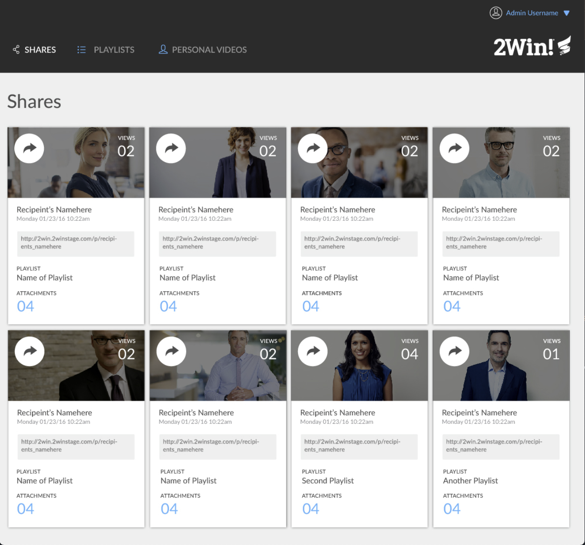
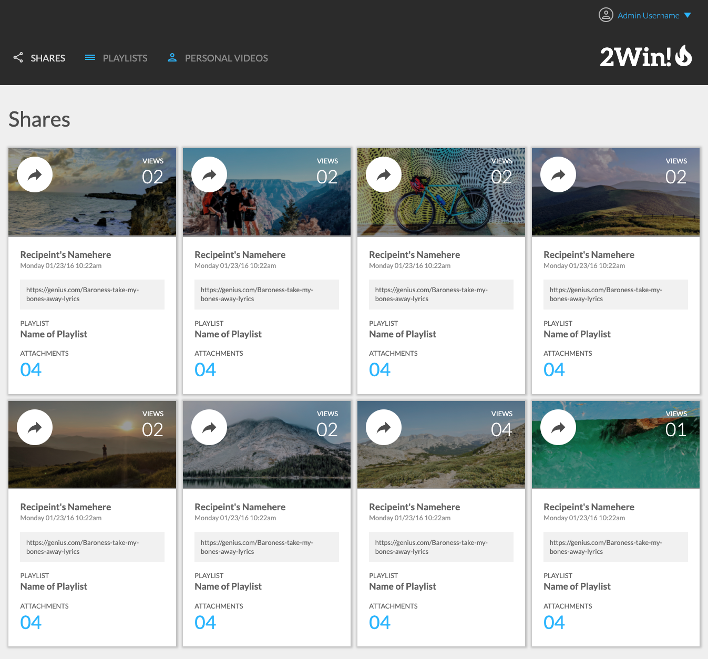
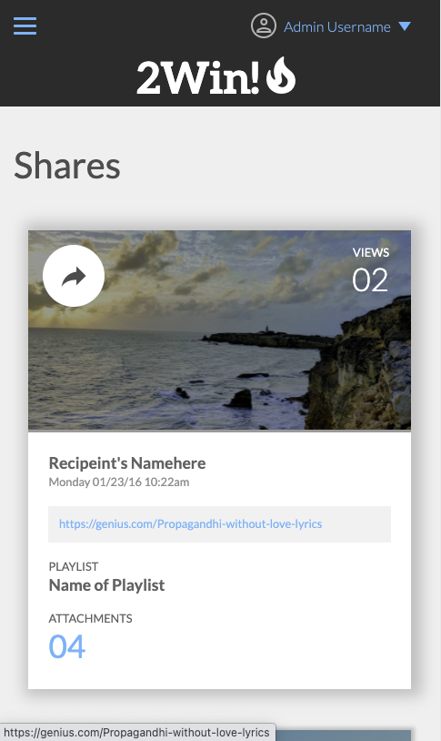
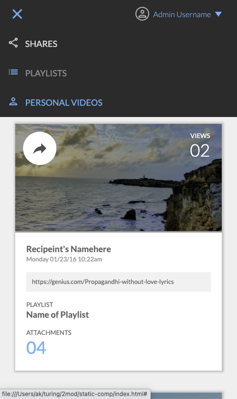
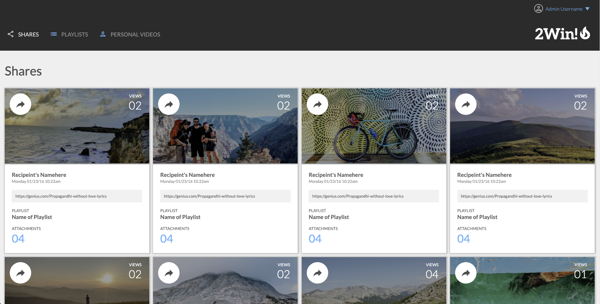
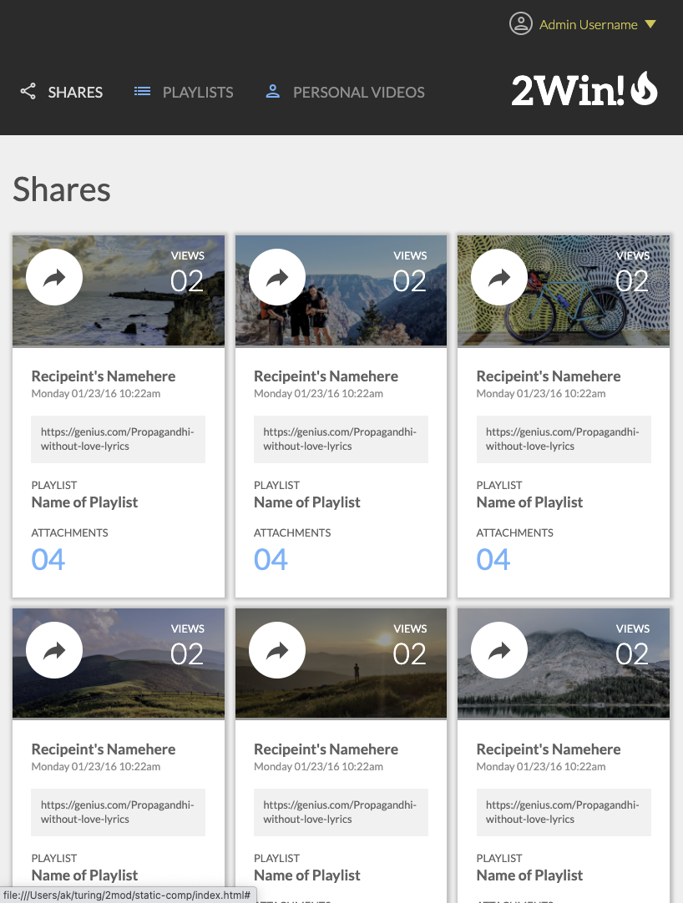

# Static Comp

Static Comp was a Mod 2 solo challenge in the Front End program at the [Turing School of Software and Design](https://turing.io/). The assignment was to build out an application to pixel perfection using only a screenshot of the desktop version of the site. No assets, fonts, sizing, spacing, color codes, etc. Nothing! What a lovely design team!

The project spec can be found [here](https://frontend.turing.edu/projects/module-1/m1-static-comp).

The project can be found [here](https://alexmkio.github.io/static-comp/).

## Goals
* Work with CSS Grid for the first time
* Strengthen responsive and mobile-first design familiarity
* Create a hamburger menu for mobile version
* Learn about image gradients and overlays
* Learn some nice on-hover tricks

## Features

* Screenshot of the static comp

* Screenshot of my creation

* Screenshot of mobile layout in 428x926 (iPhone 12 Pro Max)
* Notice the on-hover color of the link in the card

* Screenshot of mobile layout in 428x926 (iPhone 12 Pro Max)
* Notice the on-hover color of "personal videos"

* Screenshot in the most popular desktop resolution (1920x1080)
* Notice the on-hover color of "personal videos"

* Screenshot of tablet layout in 834x1194 (iPad Pro 11" 4th Gen)
* Notice the on-hover color of "Admin Username"

## Contributors

This application was built by [Alex Kio](https://github.com/alexmkio/); a Front End Engineering, Mod 1 student at the [Turing School of Software and Design](https://turing.io/).

## Technologies Used

This application uses HTML and CSS.

## Reflections on Challenges and Wins
* Win: I challenged myself to make the best product I could and I think I did a decent job. 
I would have, and wanted to, take it easier on this project but I know that my weakest skill is CSS. 
I felt like putting in a tough weekend with this project would pay dividends in the future. 
I already feel more confident and familiar with Grid, hover behavior, hamburger menus, and responsiveness. All wins!
* Challenge: I am happy that I put in good work on this project and I feel proud of the product but I wish I had another day to relax before getting another project. Hopefully I made the right decision. Also, I ran out of time to refactor, lint, learn about and implement a reset file, etc. And I feel like there are wayyyyyyyy too many divs. What's your assessment of that?

## Future Additions

I am unlikely to add any future functionality to this application, but here are some ideas for features that might improve it:

* Cross compatibility with Firefox, Safari, Chrome
* Use of normalize or reset file in CSS